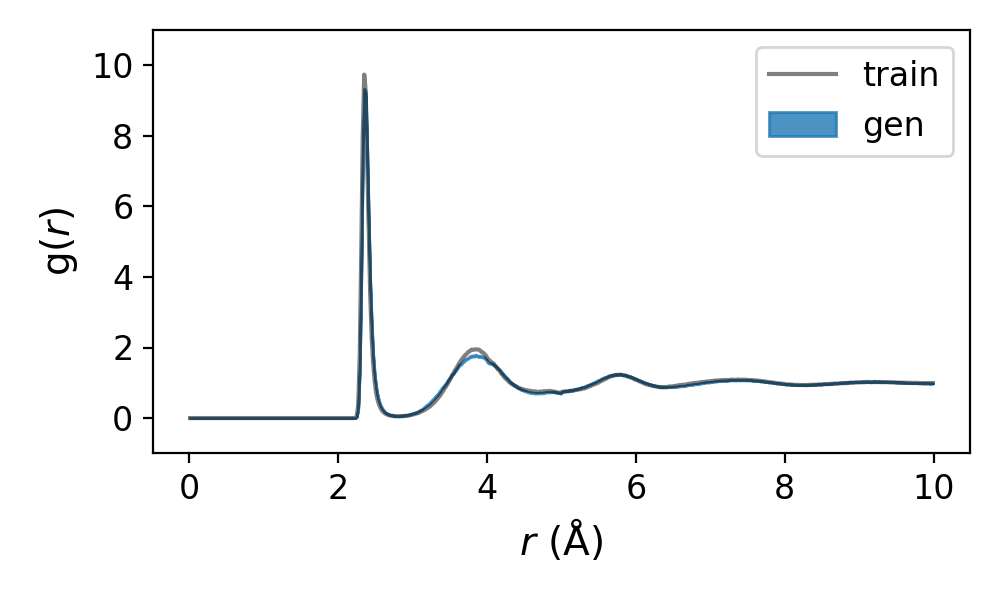

# Amorphous silicon benchmarking

## Table of contents
- [Structural relaxation](#structural-relaxation)
- [Coordination motif analysis](#coordination-motif-analysis)
- [Bond angle analysis](#bond-angle-analysis)
- [RDF analysis](#rdf-analysis)

## Structural relaxation
All necessary scripts are found in the `relax` directory.

1. Prepare your dataset in `.extxyz` format.

2. Post-process the structures to move apart atoms that are too close together:
   ```
   python /path/to/relax/move_atoms_apart.py --data_path gen.extxyz
   ```
   Any structure that still has atoms too close together (<1.5 Å by default) after `max_iter` interations (100 by default) will be rejected.

3. Download the SOAP-GAP potential provided by us, and the set the `model_path` in 
   [relax_a_Si.py](https://github.com/ertekin-research-group/Dismai-Bench/blob/main/benchmark/a_Si/relax/relax_a_Si.py) and 
   [calc_a_Si_energy.py](https://github.com/ertekin-research-group/Dismai-Bench/blob/main/benchmark/a_Si/relax/calc_a_Si_energy.py)
   to the directory containing the SOAP-GAP potential.

5. (Optional) Calculate the energy of the structures (no relaxation):
   ```
   python /path/to/relax/calc_a_Si_energy.py --data_path gen_clean.extxyz
   ```

6. Run SOAP-GAP relaxations:
   ```
   python /path/to/relax/relax_a_Si.py --data_path gen_clean.extxyz
   ```
   The relaxations can be split into batches and run in parallel over multiple cpus, if the `split_batches` tag is set to True (default).

   See [batch_relax_slurm.sh](https://github.com/ertekin-research-group/Dismai-Bench/blob/main/benchmark/a_Si/relax/batch_relax_slurm.sh) for an
   example job submission script (written for Slurm job schedulers) to run jobs in parallel.
   A working directory is created for each batch, and the `batch` tag in used by `relax_a_Si.py` to identify the batch number.

   Once all batches have completed their relaxations, collect the results by running the following command:
   ```
   python /path/to/relax/collect_batch_relax_outputs.py --n_strucs_per_batch 100
   ```

   When a structure fails to be relaxed, it would simply be logged in `discarded.csv`, and the relaxations would just continue.
   On rare occassions, especially if the structure is very poor, the entire job can crash.
   If this happens, simply run `relax_a_Si.py` again and it should restart the relaxations where it left off.
   When collecting results using `collect_batch_relax_outputs.py`, it will check if any of the batches had crashed, and return an error message if so.

7. Plot the interface energy distribution:
   ```
   python /path/to/relax/plot_energy_distribution.py --gen_data relax_results.csv --train_data /path/to/data/dismai_bench_train_ref_data/a_Si/train_energy.csv
   ```

## Coordination motif analysis
All necessary scripts are found in the `motif` directory.

1. Calculate coordination motif fingerprints:
   ```
   python /path/to/motif/get_a_Si_motifs.py --data_path gen_relaxed.extxyz
   ```
   These calculations can be split into batches and run in parallel over multiple cpus, if the `split_batches` tag is set to True (default).

   See [batch_a_Si_motif_slurm.sh](https://github.com/ertekin-research-group/Dismai-Bench/blob/main/benchmark/a_Si/motif/batch_a_Si_motif_slurm.sh) for an
   example job submission script (written for Slurm job schedulers) to run jobs in parallel.
   A working directory is created for each batch, and the `batch` tag in used by `get_a_Si_motifs.py` to identify the batch number.

   To collect the results once all batches have completed, see [collect_batch_a_Si_motif_outputs.sh](https://github.com/ertekin-research-group/Dismai-Bench/blob/main/benchmark/a_Si/motif/collect_batch_a_Si_motif_outputs.sh) 
   for an example bash script. 

2. Calculate coodination motif metrics:
   ```
   python /path/to/motif/get_a_Si_motif_metrics.py --data_train /path/to/data/dismai_bench_train_ref_data/a_Si/train_motif/cnn_stats_Si_train.csv --n_strucs_ori 1000
   ```
   Remember to download the training dataset motif data and set `data_train` to the correct path.

   Set `n_strucs_ori` to the number of structures that was in your original dataset (before any post-processing and relaxation).

4. Get the distribution of most likely coordination motifs:
   ```
   python /path/to/motif/plot_most_likely_motifs/get_most_likely_Si_OP.py --data_train /path/to/data/dismai_bench_train_ref_data/a_Si/train_motif/cnn_stats_Si_train.csv
   ```

5. Plot the distribution of most likely coordination motifs:
   ```
   python /path/to/motif/plot_most_likely_motifs/plot_most_likely_Si_OP.py
   ```
   <p align="center">
      
   </p>

## Bond angle analysis
All necessary scripts are found in the `bond_angle` directory.

1. Calculate bond angles:
   ```
   python /path/to/bond_angle/get_a_Si_bond_angle.py --data_path gen_relaxed.extxyz
   ```
   These calculations can be split into batches and run in parallel over multiple cpus, if the `split_batches` tag is set to True (default).

   See [batch_a_Si_bond_angle_slurm.sh](https://github.com/ertekin-research-group/Dismai-Bench/blob/main/benchmark/a_Si/bond_angle/batch_a_Si_bond_angle_slurm.sh) for an
   example job submission script (written for Slurm job schedulers) to run jobs in parallel.
   A working directory is created for each batch, and the `batch` tag in used by `get_a_Si_bond_angle.py` to identify the batch number.

   To collect the results once all batches have completed, see [collect_batch_a_Si_bond_angle_outputs.sh](https://github.com/ertekin-research-group/Dismai-Bench/blob/main/benchmark/a_Si/bond_angle/collect_batch_a_Si_bond_angle_outputs.sh) 
   for an example bash script. 

2. Get the bond angle distributions:
   ```
   python /path/to/bond_angle/bin_bond_angles.py
   ```

3. Calculate the bond angle metric:
   ```
   python /path/to/bond_angle/get_bond_angle_metric_and_avg_distribution.py --data_train /path/to/data/dismai_bench_train_ref_data/a_Si/train_bond_angle/bond_angle_distribution_train.csv
   ```

4. Plot the average bond angle distribution:
   ```
   python /path/to/bond_angle/plot_avg_bond_angle_distribution.py
   ```
   <p align="center">
      
   </p>

## RDF analysis
All necessary scripts are found in the `rdf` directory.

1. Calculate RDFs:
   ```
   python /path/to/rdf/get_rdf_Si-Si.py --data_path gen_relaxed.extxyz
   ```

2. Calculate the RDF metric:
   ```
   python /path/to/rdf/get_rdf_metric_and_avg_rdf.py --data_train /path/to/data/dismai_bench_train_ref_data/a_Si/train_rdf/rdf_Si-Si_train.csv
   ```

3. Plot the average RDF:
   ```
   python /path/to/rdf/plot_avg_rdf_Si_Si.py
   ```
   <p align="center">
      
   </p>

