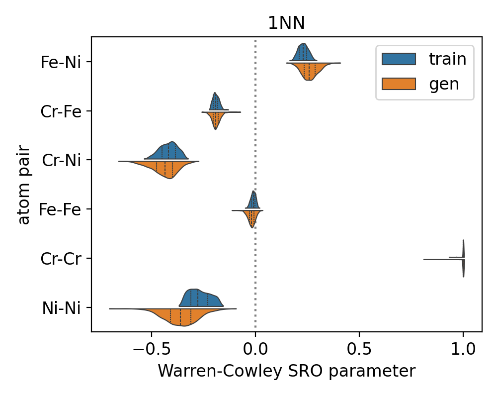

# Disordered stainless steel alloy benchmarking

## Table of contents
- [Post-processing](#post-processing)
- [Cluster analysis](#cluster-analysis)

## Post-processing
1. Prepare your dataset in `.extxyz` format.

2. Post-process the structures to remove atoms not on lattice sites:

   A reference lattice (4×4×4 FCC lattice; see [alloy_ref_struc.extxyz](https://github.com/ertekin-research-group/Dismai-Bench/blob/main/benchmark/alloy/alloy_ref_struc.extxyz))
   is used to determine if the atoms in a structure are on the lattice sites.
   
   The reference lattice is constructed differently according to the generative model used:<br/>
   i.   CryinGAN – reference lattices are used as is.
   ```
   python remove_atoms_not_on_lattice_cryingan.py --data gen.extxyz
   ```
   
   ii.  DiffCSP – reference lattices are translated to match generated structures.
   ```
   python remove_atoms_not_on_lattice_diffcsp.py --data gen.extxyz
   ```
   
   iii. CDVAE – reference lattices are rotated and translated to match generated structures.
   ```
   python remove_atoms_not_on_lattice_cdvae.py --data gen.extxyz
   ```

   Depending on what your structures look like, you may use one of the provided scripts to post-process your dataset,
   or you can write your own algorithm to do so.


## Cluster analysis
All necessary scripts are found in the `cluster_counts` directory.

1. Count the clusters:
   ```
   python /path/to/cluster_counts/utils/main.py --data_path gen_clean.extxyz
   ```
   These calculations can be split into batches and run in parallel over multiple cpus, if the `split_batches` tag is set to True (default).

   See [batch_alloy_cluster_slurm.sh](https://github.com/ertekin-research-group/Dismai-Bench/blob/main/benchmark/alloy/cluster_counts/batch_alloy_cluster_slurm.sh) for an
   example job submission script (written for Slurm job schedulers) to run jobs in parallel.
   A working directory is created for each batch, and the `batch` tag in used by `main.py` to identify the batch number.
   
   Once all batches have completed, collect the results by running the following command:
   ```
   python /path/to/cluster_counts/collect_batch_cluster_counts.py
   ```

2. Analyze the cluster counts:
   ```
   python /path/to/cluster_counts/analyze_cluster_count.py
   ```

3. Calculate alloy metrics:

   300K narrow SRO dataset as example here,
   ```
   python /path/to/cluster_counts/get_alloy_metrics.py --data_train_dir /path/to/data/dismai_bench_train_ref_data/alloy_300K_narrow --n_strucs_ori 1000
   ```
   Remember to download the training dataset cluster data and set `data_train_dir` to the correct path.

   Set `n_strucs_ori` to the number of structures that was in your original dataset (before any post-processing).

4. Plot the formation energy distribution:

   300K narrow SRO dataset as example here,
   ```
   python /path/to/cluster_counts/plot_energy_distribution.py --gen_data formation_energy.csv --train_data /path/to/data/dismai_bench_train_ref_data/alloy_300K_narrow/train_formation_energy.csv
   ```

5. Plot the Warren-Cowley SRO parameters:

   300K narrow SRO dataset as example here,
   ```
   python /path/to/cluster_counts/plot_sro.py --gen_data cluster_sro.csv --train_data /path/to/data/dismai_bench_train_ref_data/alloy_300K_narrow/train_cluster_sro.csv
   ```
   <p align="center">
      
   </p>
